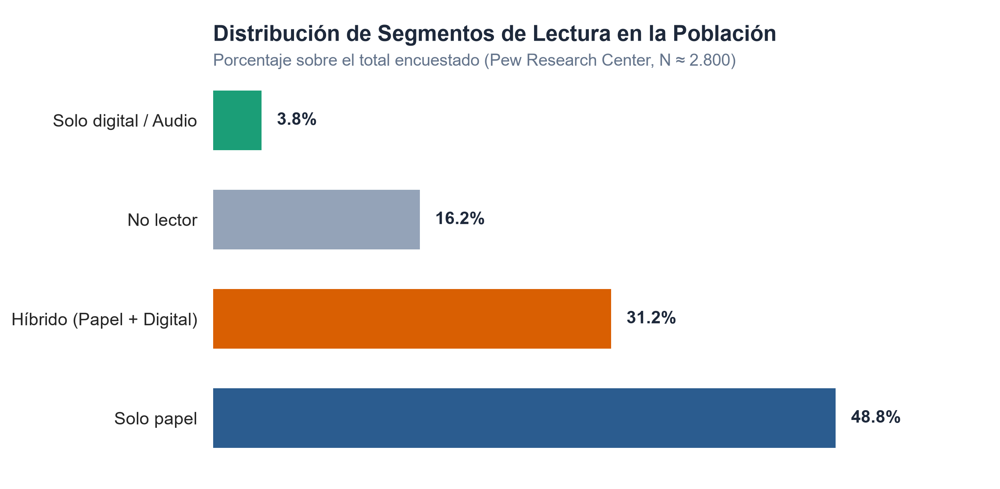
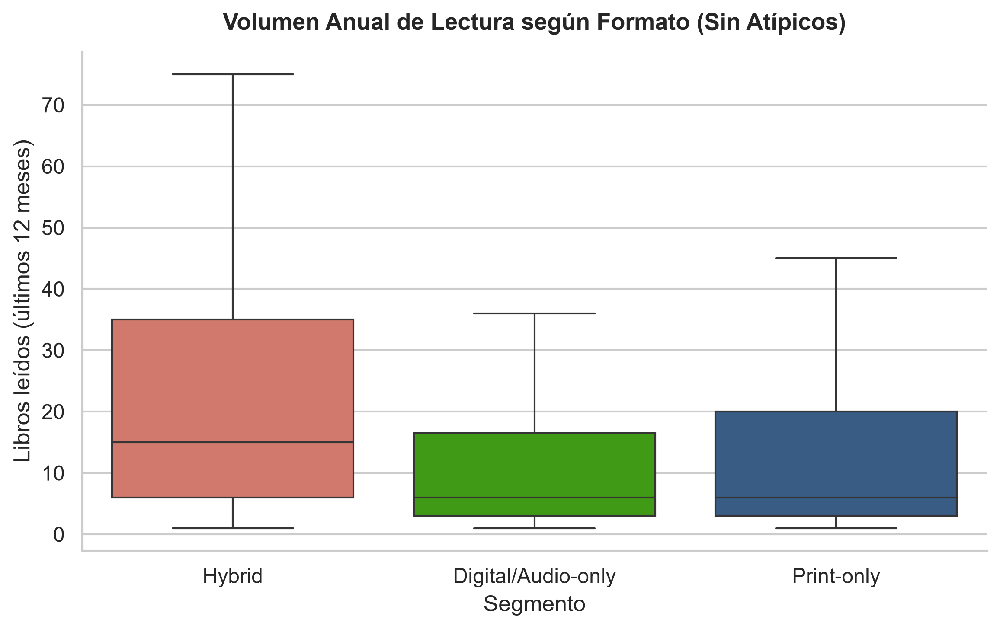
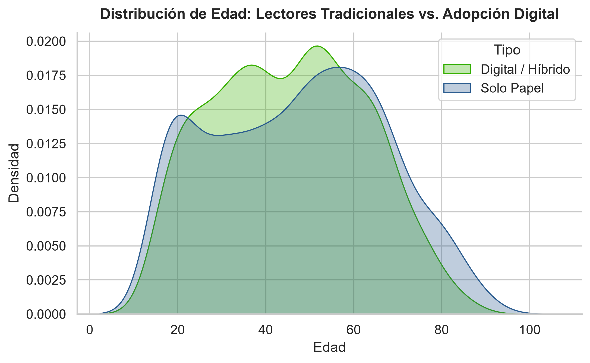

#  Análisis de Consumo de Libros: Hábitos Físicos vs. Digitales

Proyecto integral de ciencia de datos que explora los patrones demográficos y de comportamiento en la lectura, analizando la transición y convivencia entre el libro en papel, el e-book y el audiolibro.

---

##  Resumen Ejecutivo
La industria editorial debate continuamente si los soportes digitales están reemplazando al libro tradicional. Este proyecto analiza microdatos de encuestas representativas (~2.800 registros de Pew Research Center) para determinar quién consume cada formato, con qué intensidad y qué factores socioeconómicos impulsan la adopción tecnológica.

### Principales Hallazgos
* **El mito del lector exclusivamente digital:** Solo el **3,8%** de las personas lee únicamente en formatos digitales o de audio. El papel sigue siendo la base del mercado: un **48,8%** consume exclusivamente formato físico.
* **El perfil híbrido es el más voraz:** Quienes combinan papel y digital leen una mediana de **15 libros al año**, frente a los **6 libros al año** de los lectores de un único formato.
* **Educación e ingresos como predictores:** Más del **55%** de las personas con estudios de posgrado consumen libros digitales, frente al **~20%** entre quienes completaron solo la secundaria.
* **Brecha etaria:** Los lectores exclusivamente digitales conforman el grupo más joven (mediana de **41 años**), mientras que los no lectores promedian los **52 años**.

---

##  Visualizaciones del Análisis

### 1. Distribución de Segmentos de Lectores
El soporte impreso continúa liderando, pero el lector híbrido ya representa casi un tercio de la muestra total.

<p align="center">
  
</p>

---

### 2. Volumen de Lectura según Formato
La adopción de formatos digitales no canibaliza el consumo; los lectores multiformato presentan el volumen anual más elevado.

<p align="center">
  
</p>

---

### 3. Patrones Demográficos: Edad vs. Adopción Digital
Curvas de densidad que ilustran la concentración etaria entre lectores tradicionales y adoptantes de medios digitales.

<p align="center">
  
</p>

---

##  Estructura del Repositorio

```text
book-consumption-analysis/
│
├── data/
│   ├── raw/                # Microdatos originales de la encuesta (Pew Research)
│   └── processed/          # Dataset limpio con variables transformadas
│
├── notebooks/
│   ├── 01_data_cleaning.ipynb            # Pipeline de limpieza y validación de datos
│   ├── 02_eda_formats_demographics.ipynb # Análisis exploratorio y resúmenes estadísticos
│   └── 03_genres_and_metadata.ipynb      # Patrones por género y catálogo (En desarrollo)
│
├── src/
│   ├── data_pipeline.py    # Funciones modulares de ETL y transformación
│   └── plotting.py         # Configuración estética y exportación de gráficos
│
└── figures/                # Gráficos exportados en alta resolución para el reporte